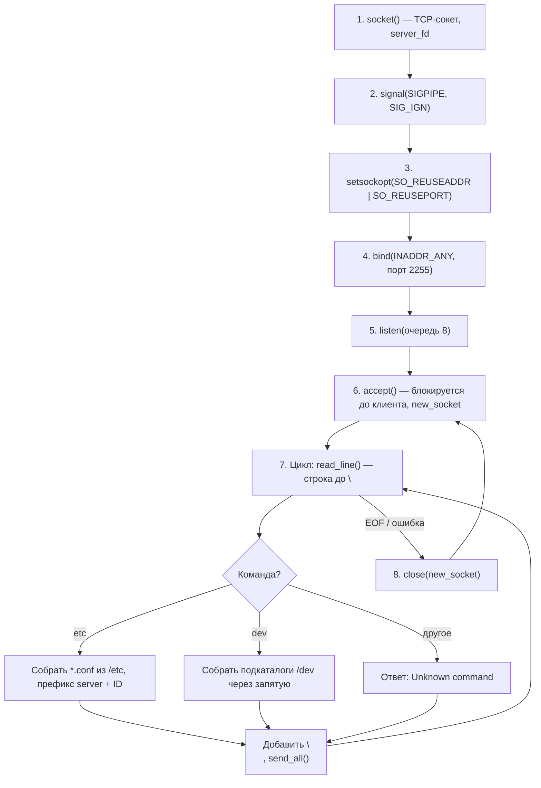

# client-server

Учебный проект: TCP-клиент и TCP-сервер на C (сокеты).

## Логика сервера

Ниже — схема жизненного цикла. На GitHub она отображается как диаграмма; в редакторе без предпросмотра Mermaid смотрите список шагов под блоком кода.



**Кратко по шагам**

1. **`socket`** — создаётся TCP-сокет.
2. **`signal(SIGPIPE, SIG_IGN)`** — запись в разорванное соединение не убивает процесс.
3. **`setsockopt`** — `SO_REUSEADDR` и `SO_REUSEPORT`, чтобы быстрее перезапускать сервер после закрытия порта.
4. **`bind`** — все интерфейсы (`0.0.0.0`), порт **2255**.
5. **`listen`** — сокет в режиме ожидания подключений.
6. **`accept`** — блокировка до подключения; для клиента создаётся отдельный дескриптор `new_socket`.
7. Пока соединение живо: чтение **построчно** (`read_line`), разбор `etc` / `dev`, формирование ответа, отправка через **`send_all`**.
8. **`close(new_socket)`** — конец сессии с клиентом, снова **`accept`** для следующего.

> Номера дескрипторов (3, 4, …) в примерах условны — в реальности зависят от ОС и того, какие fd уже открыты.

## Как запустить

Каталог: **`client-server_c`**.

1. Сборка:

   ```bash
   make
   ```

2. **Терминал A** — только сервер:

   ```bash
   ./server
   ```

   Процесс будет ждать подключений — это нормально. **Не вводите** здесь `etc` / `dev`: сервер читает данные **из сокета**, а не с клавиатуры.

3. **Терминал B** — клиент:

   ```bash
   ./client
   ```

   Либо вручную:

   ```bash
   nc 127.0.0.1 2255
   ```

   Дальше вводите `etc` и Enter, затем `dev` и Enter (именно **`dev`**, не `dev/`).

4. Остановить сервер: в терминале A — **Ctrl+C**.

## Пример обмена

| Направление | Сообщение |
|-------------|-----------|
| Клиент → сервер | `etc\n` |
| Сервер → клиент | `server5239,apache2.conf,…\n` *(пример; список зависит от системы)* |
| Клиент → сервер | `dev\n` |
| Сервер → клиент | `disk,input,net,…\n` *(пример)* |
| Клиент → сервер | `unknown\n` |
| Сервер → клиент | `Unknown command\n` |

## Управление ресурсами

- **`server_fd`** — открывается один раз при старте, живёт до завершения программы.
- **`new_socket`** — новый на каждый `accept`, закрывается после обработки клиента.
- **`DIR *`** в `build_etc_conf_list()` / `build_dev_dir_list()` — каталог открывается на время обхода и закрывается `closedir`.
